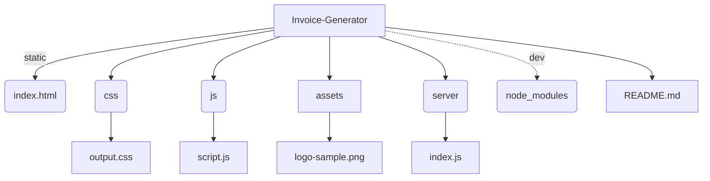

# Invoice Generator


> **Invoice Generator** is a fully‑client‑side, responsive web application that lets you **create, preview, and download professional invoices** straight from your browser. Built with **HTML**, **Tailwind CSS**, and **JavaScript** (jQuery + html2pdf.js), it requires **no server‑side setup**—all processing happens locally.

---

## ✨ Live Demo

👉 [Try it on GitHub Pages](https://adytia855.github.io/Invoice-Generator/)

---

## 🚀 Features

| Category                    | Details                                                                                              |
| --------------------------- | ---------------------------------------------------------------------------------------------------- |
| **Logo Upload**             | Drag‑and‑drop your company logo for instant preview.                                                 |
| **Dynamic Form**            | In‑place editing for invoice number/date, bill‑from / bill‑to, line items, tax, discount & shipping. |
| **Auto‑Calculations**       | Sub‑totals, tax, discounts, shipping, and grand total update in real‑time.                           |
| **Currency & % Formatting** | Inputs are formatted on‑the‑fly (e.g. `$1,200.00`, `10 %`).                                          |
| **Add / Remove Items**      | Unlimited line items with bulk delete.                                                               |
| **Preview Modal**           | See the final invoice before exporting.                                                              |
| **One‑click PDF**           | Generates a print‑ready PDF via **html2pdf.js**—no backend required.                                 |
| **Responsive UI**           | Tailwind CSS ensures it looks great on desktop, tablet, and mobile.                                  |

---

## 🏗️ Project Structure



> The `` folder contains an optional lightweight Node / Express setup for local development and GitHub Pages fallback; production builds run 100 % on the client.

---

## 🛠️ Tech Stack

- **HTML5** & **Tailwind CSS** ‒ semantic markup + utility‑first styling;
- **JavaScript (ES6)** with **jQuery** for DOM manipulation;
- **html2pdf.js** for client‑side PDF export;
- **ESLint** custom config (warn‑only unused vars) to keep code tidy;
- **Vite Dev Server** *(optional)* for hot‑reload during development.

---

## ⚙️ Getting Started

### Prerequisites

| Option        | Requirement                                                                                    |
| ------------- | ---------------------------------------------------------------------------------------------- |
| *Quick Start* | Any modern browser—just double‑click `index.html`.                                             |
| *Local Dev*   | **Node >= 18** & npm – for running the optional dev server (Vite) and installing dependencies. |

### Installation

```bash
# 1 Clone the repo
$ git clone https://github.com/Adytia855/Invoice-Generator.git
$ cd Invoice-Generator

# 2 (Optional) install dev dependencies
$ npm install

# 3 (Optional) start local dev server with hot reload
$ npm run dev

# 👉 Or simply open index.html in your browser
```

### Usage

1. Upload a logo (optional).
2. Fill in invoice, sender, and recipient details.
3. Add line items and adjust tax/discount/shipping.
4. Click **Invoice Preview** → verify layout.
5. Hit **Download PDF** → the file `invoice.pdf` is saved locally.

---

## 🤝 Contributing

Contributions are welcome!  Feel free to fork the repository and submit PRs.

1. Fork the project.
2. Create your feature branch: `git checkout -b feat/amazing-feature`.
3. Commit your changes: `git commit -m "feat: add amazing feature"`.
4. Push to the branch: `git push origin feat/amazing-feature`.
5. Open a Pull Request.

Please follow the existing code style and add ESLint overrides when necessary.

---

## 🙏 Acknowledgements

- [Tailwind CSS](https://tailwindcss.com/)
- [html2pdf.js](https://github.com/eKoopmans/html2pdf.js)
- [jQuery](https://jquery.com/)

---

> *Crafted with passion by *[*Adytia855*](https://github.com/Adytia855)*.*

